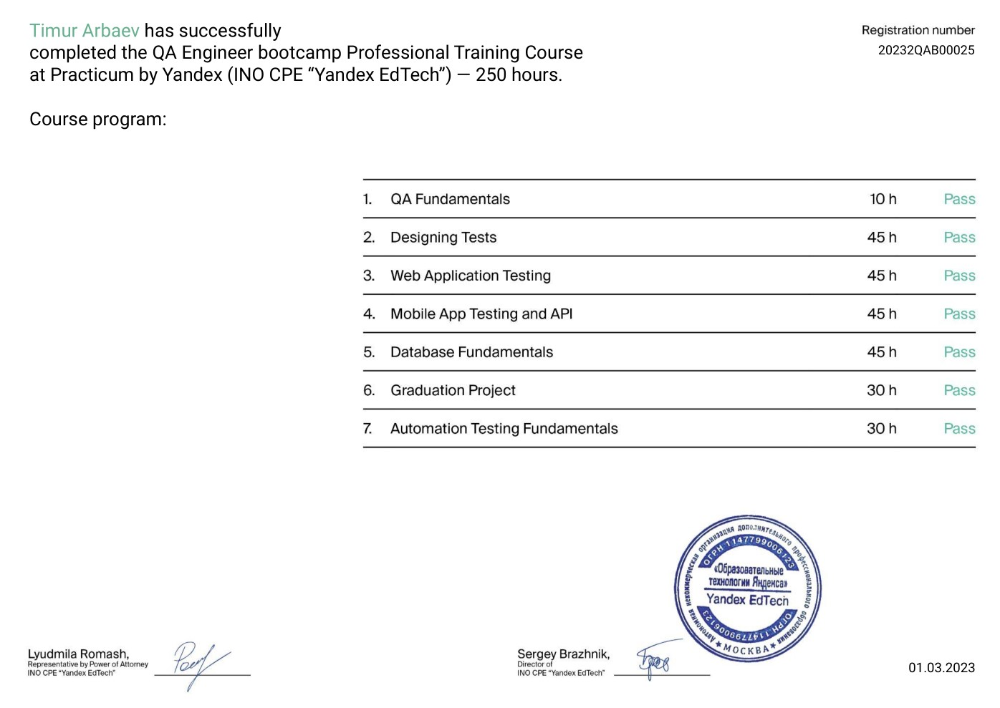

## <a name="up" />Мои проекты на курсе Яндекс.Практикум Буткемп «Инженер по тестированию»

Программа курса и мои проекты, выполненные во время обучения по специальности [Инженер по тестированию](https://practicum.yandex.ru/qa-engineer-bootcamp/) в Яндекс.Практикум, ноябрь 2022-февраль 2023.

[Проектирование тестов](#test-design) 
&nbsp;&nbsp;&nbsp;&nbsp;&nbsp;&nbsp;&nbsp;&nbsp;Тест-анализ | Декомпозиция | Визуализация требований 
&nbsp;&nbsp;&nbsp;&nbsp;&nbsp;&nbsp;&nbsp;&nbsp;Тест-дизайн | Классы эквивалентности | Граничные значения 
&nbsp;&nbsp;&nbsp;&nbsp;&nbsp;&nbsp;&nbsp;&nbsp;Тестовая документация | Чек-листы | Тест-кейсы

[Тестирование веб-приложений](#web-testing) 
&nbsp;&nbsp;&nbsp;&nbsp;&nbsp;&nbsp;&nbsp;&nbsp;Пользовательский интерфейс | DevTools | Charles 
&nbsp;&nbsp;&nbsp;&nbsp;&nbsp;&nbsp;&nbsp;&nbsp;Формы | Валидации | Тестирование адаптивности 
&nbsp;&nbsp;&nbsp;&nbsp;&nbsp;&nbsp;&nbsp;&nbsp;Окружение | Парное тестирование | Баг-репорты

[Тестирование мобильных приложений](#mobile-testing) 
&nbsp;&nbsp;&nbsp;&nbsp;&nbsp;&nbsp;&nbsp;&nbsp;Матрица устройств | Эмуляторы | Android Studio

[Тестирование API](#api-testing) 
&nbsp;&nbsp;&nbsp;&nbsp;&nbsp;&nbsp;&nbsp;&nbsp;REST API | JSON | XML 
&nbsp;&nbsp;&nbsp;&nbsp;&nbsp;&nbsp;&nbsp;&nbsp;Postman | Логирование | Swagger/Apidoc

[Тестирование баз данных](#data-bases) 
&nbsp;&nbsp;&nbsp;&nbsp;&nbsp;&nbsp;&nbsp;&nbsp;Терминал | SSH | Git | PostgreSQL

[Основы автоматизации тестирования](#test-automation) 
&nbsp;&nbsp;&nbsp;&nbsp;&nbsp;&nbsp;&nbsp;&nbsp;JavaScript | NodeJS | Puppeteer

## <a name="diploma" />Дипломная работа

#### Задание 1: Теоретическая часть

[Мои ответы по теории тестирования и пониманию SQL запросов (вкладка «Задание 1»)](https://docs.google.com/spreadsheets/d/1078FTm2fueUMFbT0OFNV3ZpdVJetjRAjeaDfPyo5JWU/edit?usp=sharing)

#### Задание 2: Веб-приложение Яндекс.Самокат

Разработай mindmap функциональности формы заказа.
Составь чек-лист по требованиям к функциональности экрана «Статус заказа».
Для экрана «Сделать заказ» составь проверки на валидацию полей.
Проведи тестирование всей функциональности не только по получившимся чек-листам/таблицам, но и по остальным макетам и требованиям. [Требования к веб приложению (pdf)](diploma/requirements_web_app.pdf)

[Мой чек-лист для статуса заказа и валидация полей формы (вкладки «Задание 2»)](https://docs.google.com/spreadsheets/d/1078FTm2fueUMFbT0OFNV3ZpdVJetjRAjeaDfPyo5JWU/edit?usp=sharing)

#### Задание 3: Мобильное приложение Яндекс.Самокат
Спроектируй тест-кейсы и протестируй функциональность, которая выделена жирным шрифтом. Не забудь написать кейсы и на вёрстку по макетам к этой функциональности. [Требования к моб приложению (pdf)](diploma/requirements_mob_app.pdf)

[Мои тест-кейсы (вкладка «Задание 3»)](https://docs.google.com/spreadsheets/d/1078FTm2fueUMFbT0OFNV3ZpdVJetjRAjeaDfPyo5JWU/edit?usp=sharing)

#### Задание 4: API приложения Яндекс.Самокат
Разработай чек-лист и протестируй API по требованиям, которые выделены жирным шрифтом. [Требования к бэкенду (pdf)](diploma/requirements_backend.pdf)

[Мой чек-лист API (вкладка «Задание 4»)](https://docs.google.com/spreadsheets/d/1078FTm2fueUMFbT0OFNV3ZpdVJetjRAjeaDfPyo5JWU/edit?usp=sharing)

[Наверх](#up)

## <a name="certs" />Сертификат

[Наверх](#up)